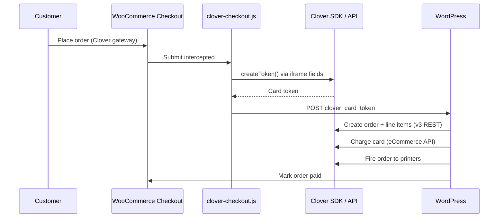

# Clover Payment Gateway for WooCommerce

[](clover-gateway.php)
[](https://wordpress.org/)
[](https://woocommerce.com/)
[](https://www.php.net/)
[](LICENSE.txt)

Accept credit and debit card payments through Clover, sync WooCommerce orders to Clover POS with real line items, and keep inventory and tax reporting aligned across both systems.

Developed by [Codewithmutahir](https://github.com/codewithmutahir).

---

## Table of Contents

- [Overview](#overview)
- [Features](#features)
- [Requirements](#requirements)
- [Installation](#installation)
- [Configuration](#configuration)
- [License Activation](#license-activation)
- [Payment Flows](#payment-flows)
- [Inventory Sync](#inventory-sync)
- [Tax Reporting](#tax-reporting)
- [Admin Tools](#admin-tools)
- [Architecture](#architecture)
- [Security & Compliance](#security--compliance)
- [Troubleshooting](#troubleshooting)
- [Development](#development)
- [Changelog](#changelog)
- [Support](#support)
- [License](#license)

---

## Overview

Clover Payment Gateway for WooCommerce bridges your online store and Clover merchant account. Customers pay via Clover’s PCI-compliant hosted card fields at checkout; orders are created in Clover with product names, quantities, shipping, fees, and tax so kitchen printers, registers, and Clover reports stay in sync.

The plugin also syncs non-card orders (Cash on Delivery, bank transfer, etc.) to Clover when they reach a processing state, and provides an admin workflow to link or export WooCommerce products to Clover inventory.

---

## Features

| Area | Capability |
|------|------------|
| **Payments** | Card tokenization via Clover iframe SDK; charges against Clover orders |
| **Checkout UI** | Compact hosted card fields (number, expiry, CVC, ZIP) styled to match WooCommerce |
| **Order sync** | Atomic order creation with line items, shipping, and custom fees; sequential fallback |
| **COD / pickup** | Orders sent to Clover printers without charging; remain **Open** until paid on device |
| **Other gateways** | COD, BACS, and other methods sync to Clover on `pending`, `processing`, or `on-hold` |
| **Duplicate prevention** | DB-level sync lock, immediate `_clover_order_id` persistence, idempotent order lookup |
| **Refunds** | Full and partial refunds from WooCommerce admin via Clover eCommerce API |
| **Inventory** | Match products by SKU/name, manual linking, bulk export to Clover |
| **Tax** | Configurable default tax rate ID; per-line `taxRates` + `taxAmount` for Clover Tax Report |
| **Reporting** | Item Sales when products are linked to Clover inventory items |
| **Admin UX** | Credential validation, tax rate browser, item cache refresh, order metabox, manual POS sync |
| **Licensing** | License key activation with weekly verification |

---

## Requirements

| Dependency | Minimum |
|------------|---------|
| WordPress | 5.8 |
| WooCommerce | 5.0 |
| PHP | 7.4 |
| HTTPS | Required for live card payments |
| Clover account | Merchant ID, v3 REST API token, eCommerce public/private keys |

---

## Installation

### From ZIP (recommended for production)

1. Download or build the plugin ZIP.
2. In WordPress admin, go to **Plugins → Add New → Upload Plugin**.
3. Upload the ZIP and click **Install Now**, then **Activate**.
4. You will be redirected to the **Clover License** screen — enter your license key.

### Manual install

1. Copy the plugin folder to `wp-content/plugins/clover-gateway/`.
2. Activate **Clover Payment Gateway for WooCommerce** under **Plugins**.
3. Complete license activation under **WooCommerce → Clover License**.

### After activation

1. **WooCommerce → Settings → Payments → Clover Payments** — enable and configure credentials.
2. **WooCommerce → Clover Sync** — link or export products (optional but recommended for Item Sales reporting).

---

## Configuration

Navigate to **WooCommerce → Settings → Payments → Clover Payments**.

| Setting | Description |
|---------|-------------|
| **Enable Clover Payments** | Turn the gateway on or off |
| **Test Mode** | Use Clover sandbox endpoints and SDK |
| **Title / Description** | Checkout labels shown to customers |
| **Merchant ID** | Clover MID (e.g. `F64XC5Q3ES9D1`) |
| **API Token** | Clover v3 REST token with inventory read access |
| **Public Key** | eCommerce public key for iframe tokenization |
| **Private Key** | eCommerce private key for charges and refunds |
| **Default Tax Rate ID** | Clover tax rate applied to order line items |

### Validate before going live

Use the built-in admin actions on the gateway settings page:

- **Validate Credentials** — live API check against Clover
- **Browse Tax Rates** — load rates and populate Default Tax Rate ID
- **Refresh item cache** — clear cached Clover inventory after catalog changes

### Clover credential sources

| Credential | Where to obtain |
|------------|-----------------|
| Merchant ID | Clover Dashboard → Account & Setup |
| API Token (v3 REST) | Developer Dashboard → API Tokens |
| eCommerce keys | Developer Dashboard → eCommerce API |

Ensure the REST token can read inventory/items so product matching and tax assignment work correctly.

### POS sync credentials

Non-card order sync (`Clover_Order_Sync`) uses gateway settings first. If those are empty, it falls back to the official **Clover Payments for WooCommerce** plugin credentials (`woocommerce_clover_payments_settings`), so COD/BACS orders can still reach Clover when only the official plugin is configured.

---

## License Activation

A valid license is required for payment processing, inventory sync, and admin tools.

1. Go to **WooCommerce → Clover License**.
2. Enter the license key provided with your purchase.
3. Click **Activate License**.

The plugin verifies the license weekly via WP-Cron. After three consecutive verification failures, premium features are disabled until the license is reactivated.

### Developer overrides

```php
// wp-config.php — point to a staging or custom licensing server
define( 'CLOVER_LICENSE_API_BASE', 'https://your-licensing-server.example/api' );
```

```php
// functions.php — filter without wp-config
add_filter( 'clover_license_api_base', function ( $url ) {
    return 'https://your-licensing-server.example/api';
} );
```

---

## Payment Flows

### Card payments



1. Clover iframe fields collect card data (never touches your server).
2. A single-use token is posted with the checkout form.
3. A Clover order is created with WooCommerce line items.
4. The card is charged against that order.
5. The order is fired to kitchen/register printers.
6. WooCommerce order status is set to paid; charge and card metadata are stored.

Checkout renders four compact iframe fields (card number, expiry, CVC, ZIP). Placeholders and styling are applied inside the Clover SDK; the plugin does not duplicate labels outside the iframe.

### COD / pay on pickup (via Clover gateway)

When checkout completes without a card token, the plugin:

1. Creates the Clover order with line items.
2. Fires it to printers.
3. Sets the WooCommerce order to **On hold**.
4. Leaves the Clover order **Open** until payment is collected on a Clover device.

### Other payment methods (COD, BACS, etc.)

Orders paid with a different gateway sync automatically when status becomes `pending`, `processing`, or `on-hold`:

- Clover order is created with line items via the same atomic-order API used for card payments.
- `_clover_order_id` is saved **before** the order is fired to printers.
- A per-order DB lock prevents duplicate Clover orders when checkout and status hooks run concurrently.
- The Clover gateway payment method is skipped (it already creates its own Clover order at checkout).
- Use **Order actions → Send to Clover POS** to force a re-sync when needed.

Duplicate sync is also prevented if `process_payment()` already ran for Clover card orders.

---

## Inventory Sync

**WooCommerce → Clover Sync** provides two workflows.

### Export WooCommerce → Clover

Bulk-create Clover inventory items from WooCommerce products (simple products and variations):

- Optionally skip already-linked products.
- Assign a tax rate so the rate name appears on Clover receipts.
- Progress bar for large catalogs.

### Match / Link Products

Dry-run matching against existing Clover inventory:

| Match type | Behavior |
|------------|----------|
| Already linked | Product has `_clover_item_id` meta |
| Auto-linked | Exact SKU or normalized name match |
| Needs review | ≥ 90% name similarity |
| Possible match | 70–89% similarity |
| No match | Manual link or create in Clover |

Per-product **Clover Item ID** fields are available on simple and variable products in the product editor. Linking products enables **Reporting → Revenue → Item Sales** in Clover.

> **Safety:** Inventory sync never modifies or deletes existing Clover items. It only reads Clover catalog data and creates new items on explicit export.

---

## Tax Reporting

Tax appears correctly in Clover when:

1. **Default Tax Rate ID** is set on the gateway (use **Browse Tax Rates**).
2. Products are linked to Clover inventory items with tax rates assigned (via export or Clover dashboard).

The plugin sends both `taxRates` and computed `taxAmount` on product line items so Clover’s Tax Report attributes revenue to the named rate—not just receipt totals.

When a Default Tax Rate ID is configured:

- Tax is calculated from Clover’s stored rate value by dividing by **1,000,000,000** (one billion) to get the decimal rate—for example, `87500000 ÷ 1,000,000,000 = 0.0875` (**8.75%**).
- Order-level `taxAmount` is derived from product subtotals via `calculate_order_tax_cents()`.
- A separate WooCommerce “Tax” line item is **not** added (Clover calculates tax from line-item `taxRates`; adding both would double-count).
- Sequential order creation applies tax metadata only to product lines (shipping and fees are excluded).

Without a Default Tax Rate ID, WooCommerce tax totals are sent as a fallback “Tax” line item and order `taxAmount`.

---

## Admin Tools

| Location | Purpose |
|----------|---------|
| **WooCommerce → Settings → Payments → Clover** | Gateway credentials and tax configuration |
| **WooCommerce → Clover License** | License key management |
| **WooCommerce → Clover Sync** | Inventory export and product linking |
| **Order edit screen → Clover Payment Details** | Clover Order ID, Charge ID, amount, dashboard link |
| **Order actions → Send to Clover POS** | Manual re-sync for non-card orders |
| **Order notes** | Sync and charge events logged automatically |

Card brand and last four digits are shown in admin, customer order view, and WooCommerce PDF Invoices (when that plugin is active).

Refunds initiated in WooCommerce admin are sent to Clover when a `_clover_charge_id` exists on the order.

---

## Architecture

```
clover-gateway/
├── clover-gateway.php              # Bootstrap, constants, gateway registration
├── uninstall.php                   # Cleans credentials and license data on delete
├── includes/
│   ├── class-wc-clover-gateway.php # WooCommerce payment gateway
│   ├── class-clover-api.php        # Clover v3 REST + eCommerce API client
│   ├── class-clover-order-sync.php # COD/BACS and other non-card POS sync
│   ├── class-clover-admin.php      # Settings UI, order metabox, AJAX tools
│   ├── class-clover-inventory-sync.php
│   ├── class-clover-inventory-admin.php
│   ├── class-clover-license-manager.php
│   └── class-clover-license-setup.php
├── assets/
│   ├── js/                         # Checkout (clover-checkout.js), admin, inventory
│   └── css/                        # Admin and checkout (clover-checkout.css) styles
└── templates/
    └── payment-form.php            # Clover iframe mount points
```

### Key order meta

| Meta key | Description |
|----------|-------------|
| `_clover_order_id` | Clover order identifier |
| `_clover_charge_id` | eCommerce charge ID (card payments) |
| `_clover_amount_cents` | Total charged/synced in cents |
| `_clover_card_brand` / `_clover_card_last4` | Masked card details |
| `_clover_item_id` | Product ↔ Clover inventory link |

### External APIs

| Environment | Clover SDK | API base |
|-------------|------------|----------|
| Live | `https://checkout.clover.com/sdk.js` | Production REST / eCommerce |
| Sandbox | `https://checkout.sandbox.dev.clover.com/sdk.js` | Sandbox endpoints when Test Mode is on |

---

## Security & Compliance

- **PCI scope reduction:** Card numbers, CVV, and expiry are entered in Clover-hosted iframe fields. Raw card data never passes through WordPress.
- **Token validation:** Posted tokens are sanitized and validated with `[a-zA-Z0-9_-]+` before charge attempts.
- **Output escaping:** Checkout errors are rendered with jQuery `.text()` to prevent XSS from API error messages.
- **Capability checks:** Admin AJAX endpoints require `manage_woocommerce` and nonces.
- **Credential storage:** API tokens and private keys use WooCommerce password fields; uninstall clears sensitive values.
- **HTTPS:** Live checkout displays a warning when SSL is not enabled.

---

## Troubleshooting

| Symptom | Likely cause | Action |
|---------|--------------|--------|
| Gateway not visible at checkout | License inactive or gateway disabled | Activate license; enable under Payments |
| “Credentials invalid” | Wrong MID, token, or keys | Use **Validate Credentials**; confirm sandbox vs live |
| Product names wrong in Clover | Item cache stale | **Refresh item cache** on gateway settings |
| Item Sales report empty | Products not linked | Run Clover Sync; set `_clover_item_id` per product |
| Tax missing in Tax Report | No Default Tax Rate ID | **Browse Tax Rates** and save the correct ID |
| Tax amount wrong / doubled | Stale config or WC tax line + Clover rate | Set Default Tax Rate ID; upgrade to 1.0.2+ |
| Order synced twice | Concurrent hooks | Fixed in 1.0.2 via DB lock + meta-before-fire; check custom hooks |
| Card fields too large at checkout | Theme overrides iframe height | Hard-refresh; ensure `clover-checkout.css` loads |
| Checkout fails without HTTPS | Clover requires SSL in production | Enable TLS on the site |
| License features disabled | Weekly verify failed 3× | Re-enter key on **Clover License** screen |

Enable `WP_DEBUG_LOG` and inspect `wp-content/debug.log` for lines prefixed with `Clover:` or `Clover Sync:`.

---

## Development

### Prerequisites

- Local WordPress + WooCommerce stack (Local, wp-env, Docker, etc.)
- Clover sandbox merchant account and eCommerce keys
- Valid license key (or staging licensing API via `CLOVER_LICENSE_API_BASE`)

### Useful constants

Defined in `clover-gateway.php`:

| Constant | Purpose |
|----------|---------|
| `WC_CLOVER_GATEWAY_VERSION` | Asset cache busting |
| `WC_CLOVER_GATEWAY_PLUGIN_DIR` | Absolute plugin path |
| `WC_CLOVER_GATEWAY_PLUGIN_URL` | Plugin URL for assets |

### Branching

| Branch | Purpose |
|--------|---------|
| `main` | Production releases |
| `dev` | Active development |

### Filters

| Filter | Purpose |
|--------|---------|
| `clover_gateway_pos_sync_statuses` | WooCommerce statuses that trigger POS sync |
| `clover_gateway_skip_pos_sync_methods` | Payment methods excluded from generic POS sync |
| `clover_gateway_should_sync_order` | Include or exclude a specific order |
| `clover_gateway_link_inventory_items` | Link line items to Clover inventory on checkout |
| `clover_gateway_print_categories` | Print categories when `/fire` is unavailable |

---

## Changelog

See [readme.txt](readme.txt) for the WordPress.org-compatible changelog.

### 1.0.2

- Fix Clover tax divisor (`/ 1_000_000_000`) for line-item and order-level `taxAmount`.
- Skip WooCommerce “Tax” line item when Default Tax Rate ID is set to prevent double-counting.
- Use `calculate_order_tax_cents()` in sequential order creation; apply tax only to product lines.
- Compact checkout card form with Clover SDK styling (no duplicate external labels).
- Add `Clover_Order_Sync` for non-card orders (COD, BACS, etc.) with official-plugin credential fallback.
- Prevent duplicate POS sync via atomic DB lock, single status hook, and meta saved before `fire_order`.
- Manual **Send to Clover POS** order action; sync on `pending`, `processing`, and `on-hold`.
- Improved API error handling and idempotent order recovery after ambiguous failures.

### 1.0.1

- Fix XSS in checkout error display by escaping error messages with jQuery DOM APIs.

### 1.0.0

- Initial release: Clover card payments, order sync, tax reporting, inventory sync, COD/pickup support.

---

## Support

- **Issues:** [GitHub Issues](https://github.com/codewithmutahir/Clover-payments-gateway/issues)

For license, billing, or setup assistance, contact me

---

## License

This plugin is licensed under the [GNU General Public License v2.0 or later](LICENSE.txt).

Copyright © Elite Solution USA. All rights reserved.
